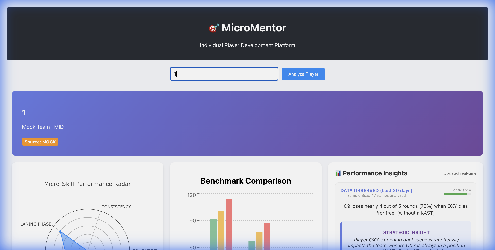
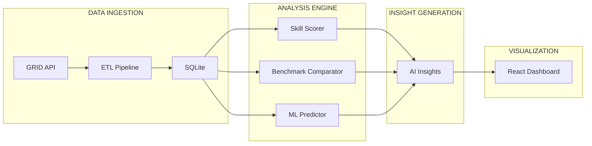

# MicroMentor - AI-Powered Individual Player Development Platform

[](https://www.python.org/downloads/)
[](https://flask.palletsprojects.com/)
[](https://reactjs.org/)
[](https://opensource.org/licenses/MIT)
[]()

**The first AI-powered platform that transforms micro-level esports analytics into actionable coaching insights.**



## New Features

| Feature | Description |
|---------|-------------|
| **Dark Mode** | Toggle between light and dark themes |
| **AI Coach Chat** | Ask questions about your gameplay with text or voice |
| **Voice Input** | "Hey MicroMentor, what if I contested Drake?" |
| **Player Comparison** | Side-by-side radar charts and head-to-head stats |
| **PDF Export** | Download coach reports for offline review |
| **Animated Charts** | Smooth transitions when switching players |
| **Loading Skeletons** | Beautiful placeholders during data fetching |
| **Goal Tracker** | Visual progress bars with milestone celebrations |

## Quick Highlights

- **20+ Micro-Skill Metrics**: Deep analysis of individual player performance
- **Role-Specific Benchmarking**: Compare against top players in your position
- **ML-Powered Predictions**: RandomForest and XGBoost models predict performance trends
- **Data-Backed Insights**: Automated feedback loops with correlation scores
- **Macro Review Agendas**: Concluded match reviews with priority-based discussion items
- **Strategic Predictor**: "What If" hypothetical scenario analysis with probability outcomes

## Architecture Overview



### Tech Stack

| Layer | Technology | Purpose |
|-------|-----------|---------|
| **Frontend** | React 18+ | Interactive dashboard with dark mode |
| **Visualization** | Plotly, Recharts | Animated radar charts, trend lines |
| **Backend** | Flask 3.1+ | REST API with CORS support |
| **ML Engine** | Scikit-learn, XGBoost | Performance prediction models |
| **Database** | SQLite (SQLAlchemy) | Portable player statistics storage |
| **Data Source** | GRID API | Official esports match data |
| **PDF Generation** | jsPDF | Client-side report export |

## Features

### AI Coach Chat
Ask questions in natural language:
- "Why did I lose lane phase?"
- "What should I focus on this week?"
- "What if I had contested Drake?"

Supports **voice input** via Web Speech API.

### Player Comparison
Compare any two players side-by-side:
- Overlapping radar charts
- Head-to-head metric comparison
- Crown indicators for each category winner

### PDF Export
Generate professional coach reports with:
- Performance overview
- AI-generated insights
- Improvement goals and progress

### API Endpoints

| Endpoint | Method | Description |
|----------|--------|-------------|
| `/api/players/<id>/profile` | GET | Player profile and metadata |
| `/api/players/<id>/micro-skills` | GET | Detailed skill breakdown |
| `/api/players/<id>/benchmarks` | GET | Role-based comparison |
| `/api/players/<id>/trends` | GET | Performance over time |
| `/api/players/<id>/insights` | GET | Data-backed recommendations |
| `/api/players/<id>/macro-review` | GET | Match review agenda |
| `/api/players/<id>/hypothetical` | POST | What-if scenario analysis |

## Quick Start

### Prerequisites

- Python 3.13+
- Node.js 18+
- (Optional) GRID API Key for live data

### Installation

```bash
# Clone and navigate
git clone https://github.com/ankitlade12/MicroMentor.git
cd MicroMentor

# Install backend dependencies
uv sync

# Configure environment
cp .env.example .env

# Initialize database
sqlite3 micromentor.db < data/sqlite_schema.sql

# Start backend
uv run api/app.py

# In a new terminal, setup frontend
cd frontend
npm install
npm start
```

## Project Structure

```
micromentor/
├── api/
│   └── app.py                # Flask REST API
├── models/
│   ├── skill_scorer.py       # Micro-skill percentile engine
│   ├── benchmark_comparator.py # Role-based comparison
│   └── performance_predictor.py # ML prediction model
├── data/
│   ├── grid_client.py        # GRID API client
│   ├── etl_pipeline.py       # Data transformation
│   └── sqlite_schema.sql     # Database schema
├── frontend/
│   ├── src/
│   │   ├── components/
│   │   │   ├── AICoachChat.js      # AI chat with voice
│   │   │   ├── PlayerComparison.js # Side-by-side comparison
│   │   │   ├── PDFExport.js        # Report generation
│   │   │   └── LoadingSkeleton.js  # Loading placeholders
│   │   ├── App.js            # Main app with dark mode
│   │   └── App.css           # CSS with theme variables
│   └── package.json
├── screenshots/              # App screenshots
├── pyproject.toml            # Python dependencies
└── README.md                 # This file
```

## What Makes MicroMentor Different

| Feature | Traditional Tools | MicroMentor |
|---------|-------------------|-------------|
| Stats | Raw numbers | Percentile rankings |
| Context | None | Role-specific benchmarks |
| Insights | Manual interpretation | AI-generated with confidence |
| Reviews | Manual VOD analysis | Automated priority agendas |
| What-If | Not available | Probabilistic scenarios |
| Comparison | Single player | Side-by-side with radar overlay |
| Export | Screenshots | Professional PDF reports |
| Voice | None | Ask questions by speaking |

## Future Roadmap

- Video clip extraction for key moments
- Real-time performance tracking
- Team synergy analysis
- Mobile application
- Multi-game support (VALORANT, CS2)

## License

MIT License - See [LICENSE](LICENSE) file

---

**Built for Cloud9 x JetBrains Hackathon using JetBrains IDEs and Junie AI**

*MicroMentor transforms raw esports data into coaching intelligence.*
