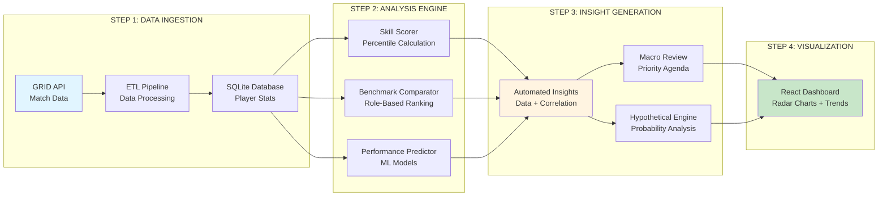
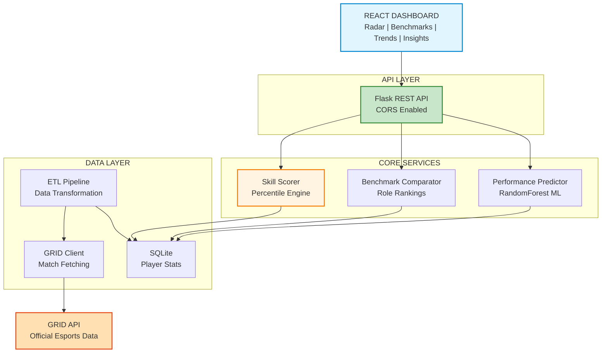
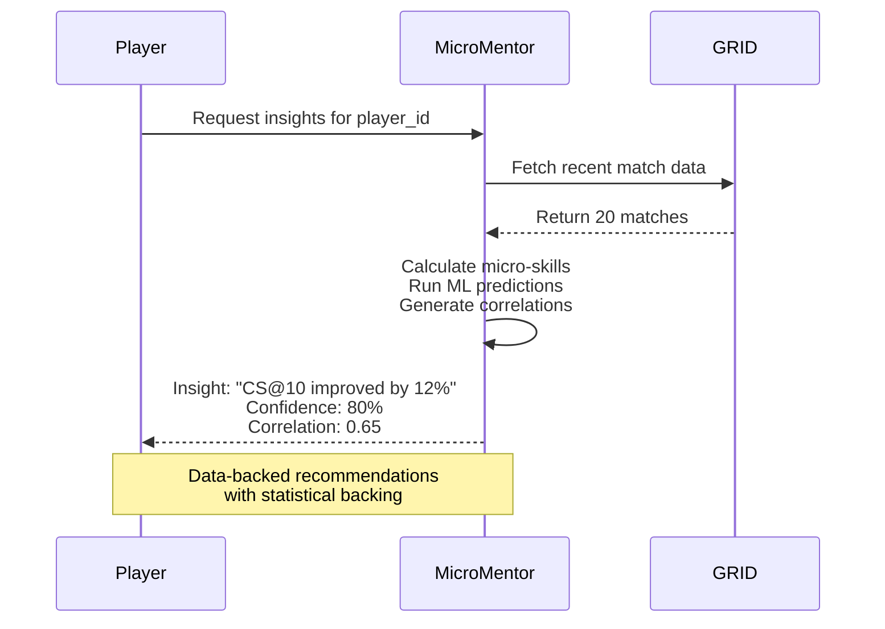

# MicroMentor - AI-Powered Individual Player Development Platform

[](https://www.python.org/downloads/)
[](https://flask.palletsprojects.com/)
[](https://reactjs.org/)
[](https://opensource.org/licenses/MIT)
[]()

**The first AI-powered platform that transforms micro-level esports analytics into actionable coaching insights.**

## Quick Highlights

- **20+ Micro-Skill Metrics**: Deep analysis of individual player performance
- **Role-Specific Benchmarking**: Compare against top players in your position
- **ML-Powered Predictions**: RandomForest & XGBoost models predict performance trends
- **Data-Backed Insights**: Automated "Data + Insight" feedback loops with correlation scores
- **Macro Review Agendas**: Concluded match reviews with priority-based discussion items
- **Strategic Predictor**: "What If" hypothetical scenario analysis with probability outcomes
- **Interactive Dashboard**: Beautiful visualizations with React, Plotly & Recharts

## Architecture Overview

### High-Level Workflow



### System Architecture



### Tech Stack

| Layer | Technology | Purpose |
|-------|-----------|---------|
| **Frontend** | React 18+ | Interactive dashboard with visualizations |
| **Visualization** | Plotly, Recharts | Radar charts, trend lines, benchmarks |
| **Backend** | Flask 3.1+ | REST API with CORS support |
| **ML Engine** | Scikit-learn, XGBoost | Performance prediction models |
| **Database** | SQLite (SQLAlchemy) | Portable player statistics storage |
| **Data Source** | GRID API | Official esports match data |
| **Package Manager** | uv | Fast dependency management |

## The Problem

Current esports analytics tools are **stats-heavy but insight-poor**:

- Show raw numbers without context
- No personalized improvement recommendations
- Require manual VOD review for macro insights
- No "what if" scenario analysis capability
- No automated data-to-insight correlation

## The Solution

MicroMentor creates a platform where:

- **Raw stats become insights** with confidence scores and correlation
- **Benchmarks are role-specific** with percentile rankings
- **Trends reveal trajectory** with visual performance over time
- **Macro reviews are automated** with priority-based agendas
- **What-if questions** get probabilistic answers

## The Mathematical Core

### Percentile Calculation

Each micro-skill is scored against role-specific benchmarks:

| Percentile | Value Range | Classification |
|------------|-------------|----------------|
| **P90+** | Top 10% | Elite Performance |
| **P75-P89** | Top 25% | Strong Performance |
| **P50-P74** | Top 50% | Average Performance |
| **< P50** | Below Median | Needs Improvement |

### Insight Confidence Formula

Each automated insight includes:
- **Data Point**: Specific statistic or correlation
- **Confidence Score**: 0-100% based on sample size and correlation strength
- **Correlation**: Statistical relationship between variables
- **Sample Size**: Number of games analyzed

## Features

### Micro-Skills Analyzed

#### Laning Phase
- CS @ 10 Minutes
- Gold Difference @ 10
- XP Difference @ 10
- Solo Kills
- Deaths in Lane

#### Vision Control
- Vision Score per Minute
- Control Wards Purchased
- Wards Placed/Cleared
- Vision Denial Efficiency

#### Combat Efficiency
- Damage per Gold
- Kill Participation %
- Death Share %
- Average Combat Rating
- KDA

#### Objective Control
- Objective Damage Share
- First Blood Participation
- Epic Monster Participation
- Tower Damage Contribution

### API Endpoints

| Endpoint | Method | Description |
|----------|--------|-------------|
| `/api/players/<id>/profile` | GET | Player profile and metadata |
| `/api/players/<id>/micro-skills` | GET | Detailed skill breakdown |
| `/api/players/<id>/benchmarks` | GET | Role-based comparison |
| `/api/players/<id>/trends` | GET | Performance over time |
| `/api/players/<id>/insights` | GET | Data-backed recommendations |
| `/api/players/<id>/macro-review` | GET | Match review agenda |
| `/api/players/<id>/hypothetical` | POST | What-if scenario analysis |

## Quick Start

### Prerequisites

- Python 3.13+
- Node.js 18+
- (Optional) GRID API Key for live data

### Installation

```bash
# Clone and navigate
git clone https://github.com/your-repo/micromentor.git
cd micromentor

# Install backend dependencies with uv
uv sync

# Configure environment
cp .env.example .env
# Add your GRID API key (optional)

# Initialize database
sqlite3 micromentor.db < data/sqlite_schema.sql

# Start backend
uv run api/app.py

# In a new terminal, setup frontend
cd frontend
npm install
npm start
```

### Environment Variables

```bash
# .env file
GRID_API_KEY=your_grid_api_key      # Optional: for live data
DATABASE_URL=sqlite:///micromentor.db
```

## Example Insights



### Sample Insight Output

```json
{
  "data": "CS@10 improved by 12% over last 10 games (85 vs 76)",
  "insight": "Your early farming is trending up. Maintain focus on wave management.",
  "confidence": 80,
  "correlation": 0.65,
  "sample_size": 10,
  "time_period": "Recent Matches"
}
```

## Project Structure

```
micromentor/
├── api/
│   └── app.py                # Flask REST API
├── models/
│   ├── skill_scorer.py       # Micro-skill percentile engine
│   ├── benchmark_comparator.py # Role-based comparison
│   └── performance_predictor.py # ML prediction model
├── data/
│   ├── grid_client.py        # GRID API client
│   ├── etl_pipeline.py       # Data transformation
│   ├── sqlite_schema.sql     # Database schema
│   └── micro_skills_taxonomy.json # Skill definitions
├── frontend/
│   ├── src/
│   │   └── ...               # React components
│   └── package.json
├── tests/
│   └── ...                   # Test suite
├── .env                      # Environment config
├── pyproject.toml            # Python dependencies
└── README.md                 # This file
```

## Hackathon Innovation

### Why MicroMentor Stands Out

1. **Data-Backed Insights**
   - Every recommendation includes confidence score and correlation
   - Transparent statistical backing for all suggestions

2. **Automated Macro Reviews**
   - No more manual VOD review for identifying issues
   - Priority-based agenda items with timestamps

3. **What-If Scenario Engine**
   - Answer hypothetical questions about past decisions
   - Multi-scenario probability analysis

4. **Role-Specific Benchmarks**
   - Compare against your position, not all players
   - Percentile rankings within your role

5. **JetBrains Junie AI Integration**
   - End-to-end development with AI assistance
   - Rapid prototyping and iteration

### The Gap We Fill

| Feature | Traditional Tools | MicroMentor |
|---------|-------------------|-------------|
| Stats | Raw numbers | Percentile rankings |
| Context | None | Role-specific benchmarks |
| Insights | Manual interpretation | Automated with confidence |
| Reviews | Manual VOD analysis | Automated priority agendas |
| What-If | Not available | Probabilistic scenarios |

## Future Roadmap

- [ ] Video clip extraction for key moments
- [ ] Real-time performance tracking
- [ ] Team synergy analysis
- [ ] Mobile application
- [ ] Integration with streaming platforms
- [ ] Multi-game support (VALORANT, CS2)

## License

MIT License - See [LICENSE](LICENSE) file

## Acknowledgments

- Cloud9 for the hackathon opportunity
- JetBrains for Junie AI and amazing IDEs
- GRID for providing official esports data

---

**Built with ❤️ for Cloud9 x JetBrains Hackathon using JetBrains IDEs and Junie AI**

*"MicroMentor transforms raw esports data into actionable coaching intelligence."*
